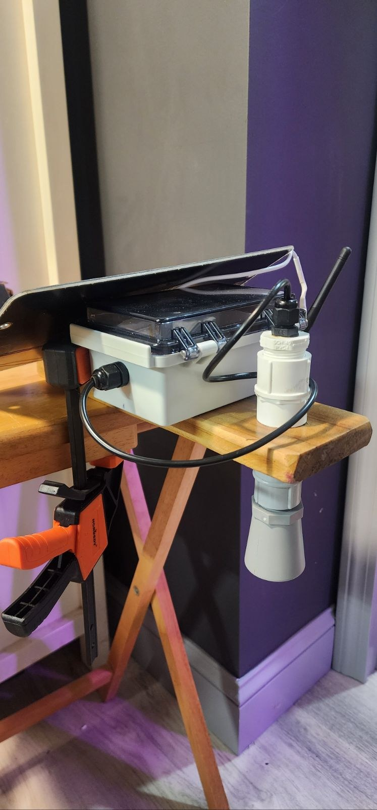
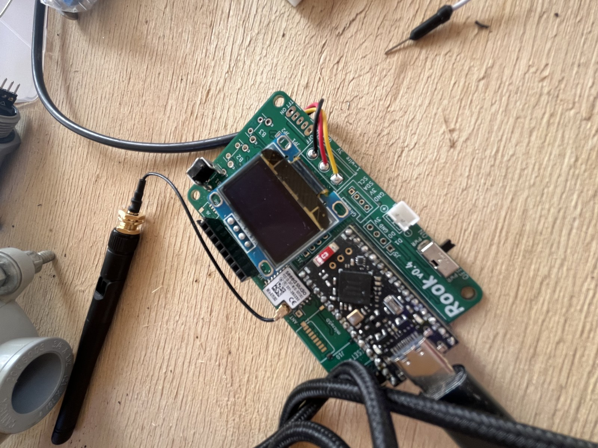
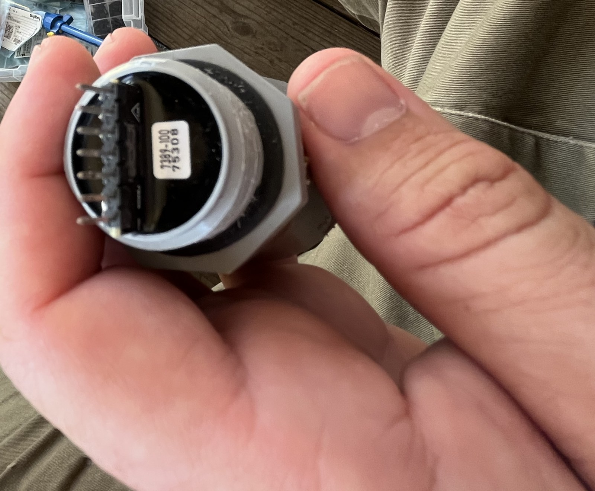
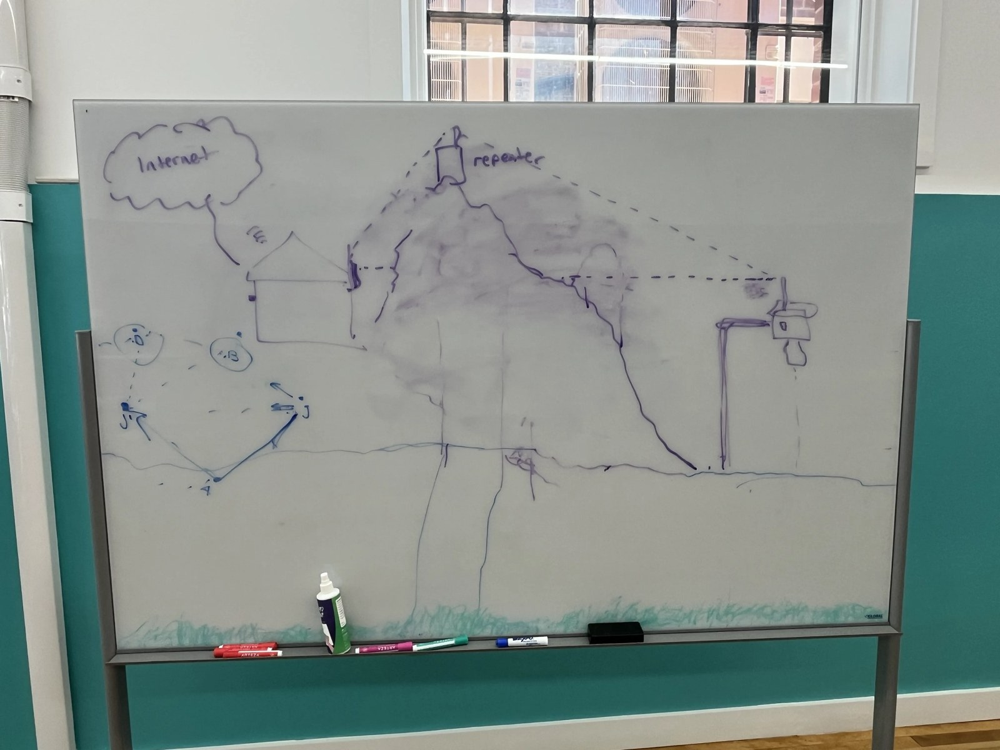

# Bill of materials

This bill of materials (BOM) covers one complete water-level sensor node plus the receiver used during development. The node measures the distance to a water surface with an ultrasonic rangefinder and reports readings over LoRa (Long Range), a low-power radio scheme that carries small packets for kilometers. Prices were checked in July 2026 against the linked pages; treat them as approximate and expect drift.

## Core electronics

**1. Rook v0.4 carrier board (Don Blair / PVOS)**

The custom printed circuit board (PCB) that ties everything together: it hosts the microcontroller module and the radio module, breaks out the sensor and display connections, and includes the power-gating transistor that switches the sonar on and off. Open hardware; the KiCAD design files live in the repository under `hardware/`.

- Source: https://github.com/p-v-o-s/rook (verified July 2026; public repo with `hardware/`, `firmware/v_0.4`, and `plate/` directories)
- Price: not sold assembled. Fabricating the bare board from the KiCAD files at a prototype service such as JLCPCB or OSH Park typically runs $5 to $30 for a small batch, typical range based on standard two-layer prototype pricing, not a quote. You then hand-solder the modules and connectors.
- Caveats: board silkscreen on v0.4 has known labeling errors (the top connector's GND and 3V labels are swapped), so wire against the schematic, not the silkscreen.

**2. SuperMini nRF52840 microcontroller module (Nice!Nano-compatible, TENSTAR "red board" recommended)**

The brains of the node: a small board in the Pro Micro footprint carrying a Nordic nRF52840 microcontroller unit (MCU) with built-in Bluetooth, a lithium battery charger, and a USB-C port for programming. It plugs into the Rook carrier.

- Source (verified): https://www.tindie.com/products/adz1122/supermini-nrf52840-development-board-for-nicenano/ at $9.90 as of July 2026
- Source (cheaper, unverified fetch): TENSTAR listings on AliExpress, typically $3 to $6 per board. AliExpress blocks anonymous page fetches, so listings and prices there could not be machine-verified.
- Caveats: this clone family has a documented power defect. Early batches leak about 700 microamps in deep sleep because of a wrong pull-up resistor on the power-control pin, versus about 20 microamps on a genuine Nice!Nano. The joric/nrfmicro wiki documents the defect and the fix, and notes that black and red TENSTAR boards made from 2025 onward use 500 kilo-ohm or larger resistors (leak around 6 microamps), with red boards from late 2024 also carrying an updated low-dropout regulator (LDO). Buy the TENSTAR red-board variant, or be prepared to swap one resistor. Reference: https://github.com/joric/nrfmicro/wiki/Alternatives (verified July 2026).

**3. Seeed Studio Wio-SX1262 LoRa radio module**

The radio that actually transmits the water-level readings. It is built around the Semtech SX1262 transceiver chip and solders onto the Rook carrier board. Identification is from the Rook schematic itself: the radio symbol and footprint in `rook.kicad_sch` are `sweet-p:wio-sx1262` / `wio-sx1262:wio-sx1262-extended`, i.e. this exact module.

- Source: https://www.seeedstudio.com/Wio-SX1262-Wireless-Module-p-5981.html at $4.29 as of July 2026
- Caveats: order the band matching your region (US915 for North America, EU868 for Europe). You also need a matching antenna; the module uses a small coaxial connector, so budget a few dollars for a 915 MHz antenna and pigtail if your kit does not include one.

## Sensor

**4. MaxBotix MB7388 ultrasonic rangefinder (HRXL-MaxSonar-WR family)**

The actual water-level sensor. It hangs above the water, pings ultrasonically, and reports the distance to the surface once per reading, from 500 mm out to 10 m with millimeter resolution. The housing is IP67 weather resistant (sealed against rain and temporary immersion) and threads into standard 3/4 inch PVC pipe fittings, which makes mounting easy. The node reads its TTL (transistor-transistor logic) serial output, a simple one-wire-plus-ground data stream, through the microcontroller's UART (Universal Asynchronous Receiver-Transmitter).

- Product page: https://maxbotix.com/products/mb7388 at $109.95 as of July 2026 (page title: "MB7388 HRXL-MaxSonar-WRMLT")
- Family overview: https://maxbotix.com/pages/hrxl-maxsonar-wr-ultrasonic-sensor-line (verified July 2026)
- Caveats: this is the single most expensive part of the node. Shorter-range siblings in the same family (7.5 m, 5 m) are cheaper if your deployment does not need the full 10 m. The sensor's serial output idles at its supply voltage; since this build powers the sensor from the battery rail, put the series resistor from item 9 in the data line to protect the 3.3 V microcontroller input.

## Display and enclosure

**5. 0.96 inch SSD1306 OLED display, 128x64, I2C**

A small organic light-emitting diode (OLED) screen that shows live range readings and battery voltage in the field, which makes install-time sanity checks much easier. The firmware drives a 128x64 panel with the SSD1306 controller over I2C (Inter-Integrated Circuit, a two-wire data bus), confirmed by the display constructor in the firmware source (`Adafruit_SSD1306 oled(128, 64, ...)`).

- Reference source: https://www.adafruit.com/product/326 at $17.50 as of July 2026
- Caveats: functionally identical generic modules are everywhere on Amazon and AliExpress for $3 to $6, typical range based on common multi-pack listings, not a fetched price. Any "0.96 inch 128x64 SSD1306 I2C" module with a 4-pin header (VCC, GND, SCL, SDA) works. Check the I2C address (0x3C is typical) against the firmware.

**6. MAKERELE MKMTY-151007 waterproof junction box, 150x100x70 mm, clear lid**

The weatherproof housing for the electronics. The clear hinged lid lets you read the OLED without opening the box.

- Source: https://www.amazon.com/dp/B09CMJQ921 (URL verified July 2026; resolves to "MAKERELE ABS Plastic Small Outdoor Waterproof Box Clear Hinged Shell ... 5.9x3.9x2.8 inch (150x100x70mm)")
- Price: Amazon did not expose the price to an anonymous page fetch, so no verified number; comparable clear-lid ABS boxes this size list in the $10 to $20 range on Amazon, typical range, not a fetched price.
- Caveats: you will drill it for the sensor mount and antenna, so buy a spare. Use cable glands or PVC fittings to keep the holes weatherproof.

## Power

**7. Single-cell LiPo battery, 3.7 V, JST-PH connector**

A rechargeable lithium polymer (LiPo) cell powers the whole node; the microcontroller module's onboard charger tops it up over USB. Capacity is your call: bigger cell, longer time between charges.

- Sourcing note: any 3.7 V single-cell pack with a JST-PH 2-pin connector works. Adafruit's lithium-ion battery category is a reliable US source with correct connector polarity: https://www.adafruit.com/category/574 (verified July 2026; examples: 1200 mAh at $9.95, 2500 mAh at $14.95)
- Caveats: JST-PH polarity is not standardized across vendors. Cheap cells from marketplaces sometimes arrive with reversed pins, which can destroy the board on first plug-in. Meter the connector against the board's markings before connecting anything.

## Receiver / gateway (development)

**8. Heltec WiFi LoRa 32 V4**

The board used on the receiving end during development: an ESP32-S3 microcontroller with WiFi plus the same SX1262 LoRa radio as the node, and its own small display. One of these on your desk gives you a live view of what the node is transmitting.

- Source: https://heltec.org/project/wifi-lora-32-v4/ at $17.90 to $27.50 as of July 2026, depending on band, display, and warehouse options
- Caveats: pick the LoRa band matching the node's radio.

## Miscellaneous

**9. Small parts**

- 1 kilo-ohm resistor, 1/4 W, in series with the sonar's TTL serial data line into the microcontroller. Protects the 3.3 V input from the sensor's battery-level idle-high voltage. Pennies each; any resistor assortment covers it.
- Hookup wire, 24 to 26 AWG stranded, for sensor, display, and battery runs.
- JST-PH connector pigtails or a crimp kit, so the battery and sensor unplug for service.
- M3 machine screws, nuts, and standoffs to mount the board stack and display inside the enclosure.
- No individual prices verified for these; as a class they total a few dollars from any electronics assortment or existing parts bin.

## Cost summary

Verified prices alone (sensor $109.95, radio $4.29, MCU module $9.90 Tindie or about $4 AliExpress, display $17.50 Adafruit or about $4 generic, receiver about $20, battery about $10 to $15) put a single node in the neighborhood of $160 to $180 with name-brand parts, or closer to $140 sourcing the module and display from marketplace vendors, plus PCB fabrication and the enclosure. The MB7388 dominates the cost.

## Where this is headed

The sketch below is the deployment shape this hardware serves: sensor nodes at
the water, a hilltop repeater, and a gateway with an internet connection
forwarding readings out.

